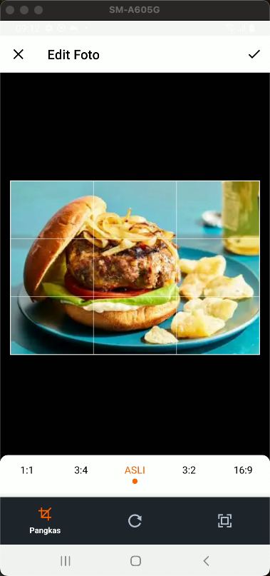

# AI Food Recognizer App

<div align="center">


[](https://flutter.dev/)
[](https://www.tensorflow.org/lite)
[](https://ai.google.dev/)
[](LICENSE)

</div>

A Flutter application that recognizes food from images using TensorFlow Lite and provides recipe and nutrition information. The app combines on-device machine learning with cloud-based AI for comprehensive food details.

## Features

- **Food Recognition**: Uses a TFLite model to identify food items from user photos
- **Realistic Confidence Scores**: Provides meaningful confidence levels for predictions
- **Recipe Suggestions**: Shows recipes based on recognized food items
- **Nutrition Information**: Displays nutritional information for identified foods
- **Multi-source Label Support**: Uses multiple label files for better food identification
- **Knowledge Graph ID Support**: Handles specialized food IDs for better matching

## App Screenshots

<div align="center">
  
  
  
  
</div>

## Recent Updates

### Improved Confidence Score Display

- Added a more realistic confidence score calculation that avoids always showing 100%
- Implemented a visual confidence bar with color indicators
- Added descriptive confidence level texts
- See [confidence score implementation documentation](docs/confidence_score_implementation.md) for details

### Enhanced Model Label Extraction

- Now supports both primary and fallback label files
- Better handling for Knowledge Graph IDs and special labels

## Technical Implementation

The app uses:

- TensorFlow Lite for on-device inference
- Firebase ML for model management
- Gemini API for enhanced recipe and nutrition information
- Flutter for cross-platform UI
- Environment variables for secure API key storage

### Architecture Diagram


### Key Components

1. **UI Layer**: Flutter screens and widgets for user interaction
2. **Service Layer**: Core functionality including ML inference and API interactions
3. **Model Layer**: Data structures for predictions and nutrition information
4. **Utility Layer**: Helper classes for label extraction and environment validation

## Getting Started

### Prerequisites

- Flutter SDK (version 3.x or higher)
- Dart SDK (version 3.x or higher)
- Android Studio or VS Code with Flutter extensions
- A Gemini API key (from Google AI Studio)
- Firebase project (for ML model downloading)

### Installation Steps

1. **Clone the repository**

   ```bash
   git clone https://github.com/yourusername/ai_food_recognizer_app.git
   cd ai_food_recognizer_app
   ```

2. **Set up environment variables**

   ```bash
   cp .env.example .env
   ```

3. **Add your API keys to the `.env` file**

   ```
   GEMINI_API_KEY=your_api_key_here
   ```

4. **Install dependencies**

   ```bash
   flutter pub get
   ```

5. **Run the app**
   ```bash
   flutter run
   ```

### Troubleshooting

- If you encounter issues with the TensorFlow Lite model, check the `assets/ML/` directory to ensure all model files are present
- For Firebase ML model downloader issues, verify your Firebase configuration in `firebase_options.dart`
- If Gemini API calls fail, confirm your API key is correctly set in the `.env` file

## Testing

Run tests with: `flutter test`

## Environment Setup

This application uses environment variables for secure configuration. For detailed setup instructions, see the [Environment Variables Setup](docs/environment_variables_setup.md) documentation.

Key environment variables:

- `GEMINI_API_KEY`: Required for food description, nutrition information, and recipe enhancement features

## Application Flow

The AI Food Recognizer App follows this workflow:


1. **Image Capture**: Users can take a photo of food using the camera or select an image from the gallery
2. **Food Recognition**: The TFLite model processes the image to identify the food
3. **Results Display**: The app shows the recognized food with a realistic confidence score
4. **Detailed Information**: Users can view nutritional facts and recipe suggestions in separate tabs
5. **AI-Enhanced Content**: Gemini AI enhances food descriptions and recipe recommendations

## Contributors

- Developer Team @ DICODING
- Created on: June 2025

## License

This project is licensed under the MIT License - see the [LICENSE](LICENSE) file for details.

## Acknowledgements

- Google for providing the Gemini API and TensorFlow Lite
- Flutter team for the excellent cross-platform framework
- DICODING for project guidance and support
